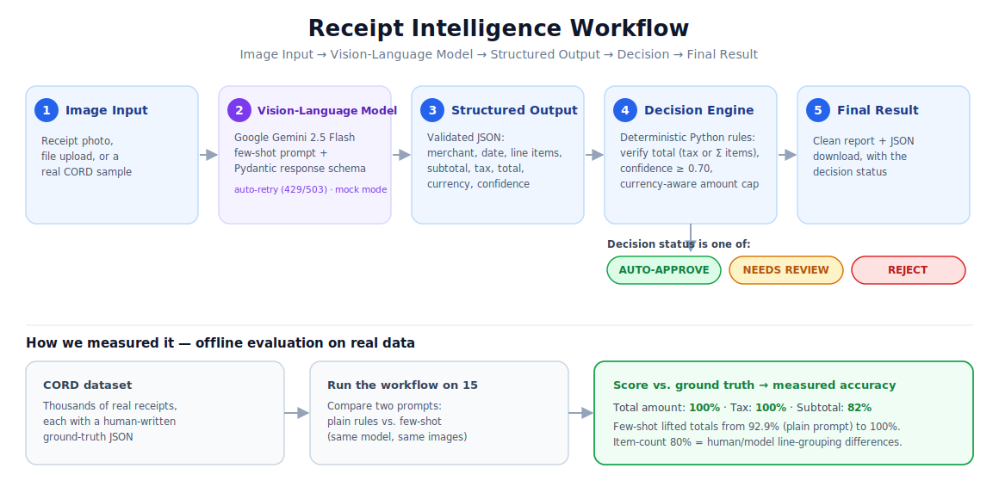
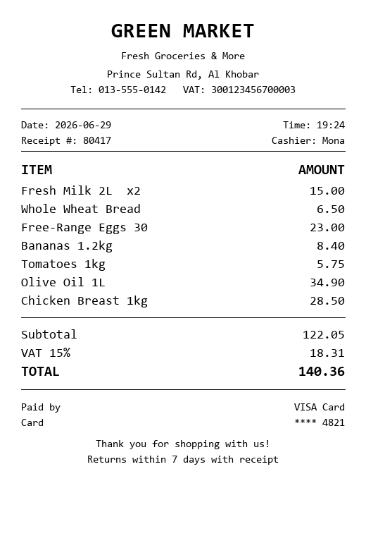

# Receipt Intelligence Workflow

An AI workflow that reads a receipt image with a Vision-Language Model, turns it into structured JSON, and runs that JSON through a decision engine to reach a final result. This is the same input-to-decision pattern that tools like n8n and Dify are built on, implemented end to end and backed by numbers, not just a single demo screenshot.

**Live app:** https://receipt-intelligence-workflow-cbml7urdjtntacety4jmhy.streamlit.app
**Repository:** https://github.com/saudrawdhan/receipt-intelligence-workflow

This is Task 2 of my training. The brief asked for a small working workflow; I went further and built it as something I could actually stand behind:

- **Deployed and usable**, not just runnable on my machine. Anyone can open the link above and try it, live or in a no-key mock mode.
- **Tested on real data**, not one cherry-picked receipt. It runs against 15 real receipts from the public CORD dataset, each with a human-written ground truth.
- **Measured, not assumed.** I ran an A/B test between two prompts on the same model and the same images, and the numbers decided the winner: total-amount accuracy went from 92.9% to 100% after adding few-shot examples.
- **A decision engine that actually decides.** The model only reads the receipt; a separate, currency-aware rule engine in plain Python verifies the numbers and produces `AUTO_APPROVE`, `NEEDS_REVIEW`, or `REJECT`.
- **Resilient by design.** Automatic retry on rate limits, a mock mode that needs no API key, and an offline evaluation mode that re-scores saved results with zero API calls.

## What it does

Given a photo or scan of a receipt, the workflow:

1. reads the image with Google Gemini 2.5 Flash,
2. returns a strict JSON object (merchant, date, line items, subtotal, tax, total, currency, confidence, and so on),
3. runs a decision step in plain Python that verifies the numbers and returns `AUTO_APPROVE`, `NEEDS_REVIEW`, or `REJECT`,
4. and outputs a clean report plus JSON.

It can be used three ways: a command-line tool, a Streamlit web app, and a walkthrough notebook.

## Workflow structure

Simple view:

```
Image Input
    ↓
Vision-Language Model (Gemini 2.5 Flash)
    ↓
Structured Output (validated JSON)
    ↓
Decision / Action (Python rules)
    ↓
Final Result (report + JSON + status)
```

Detailed view (the real system, including the evaluation branch):



Where the decision happens: the AI model only reads the receipt. The decision itself is made by plain Python rules in [`src/decision.py`](src/decision.py). It verifies the total (by `subtotal + tax`, or by summing the line items), requires a confidence of at least 0.70, and applies a currency-aware amount limit. Keeping the decision out of the model makes it predictable and easy to explain.

## Structured output (the important part)

The model is told to answer in a fixed shape using a Pydantic schema ([`src/schema.py`](src/schema.py)), which is passed to Gemini as its `response_schema`. That way the output is always clean fields instead of a loose paragraph. The schema covers exactly the fields this task asks for:

| Required field | In our output |
| --- | --- |
| Image type | `image_type`, `is_receipt` |
| Main information detected | `merchant_name`, `line_items`, `subtotal`, `tax`, `total`, `currency`, ... |
| Main finding | `main_finding` |
| Confidence / uncertainty | `confidence`, `uncertainty_notes` |
| Recommended action / next step | decision `status` + `recommended_action` |

## Vision-Language Model used

Google Gemini 2.5 Flash, through the official `google-genai` SDK.

I chose it for three reasons: it has a free tier with no credit card, it understands images and text together, and it supports structured JSON output through a schema, so the extraction is reliable instead of fragile text parsing. I avoided Gemini 2.0 Flash on purpose because it is deprecated and would stop working later. A lighter model (`gemini-2.5-flash-lite`) is also supported through the `GEMINI_MODEL` setting. The client retries automatically on temporary `429/503` errors and has a mock mode for running offline.

## The prompt

The full prompt is in [`src/prompt.py`](src/prompt.py). Its core rules:

```
You are a precise receipt and invoice analysis system.
Analyze the provided image and fill in the required structured schema.

- If the image is NOT a receipt/invoice, set is_receipt=false and leave money fields null.
- Extract every visible line item with its description and amount.
- Monetary fields are numbers only; put the currency in a separate field (infer from
  context such as address / VAT number when it is not printed).
- Read amounts by locale: some currencies have NO cents (Indonesian Rupiah), where a
  dot/comma is a thousands separator ("60.000" = 60000); currencies like SAR use decimals.
- Use null for anything you cannot read confidently. Do not guess.
- confidence: 0.0-1.0 self-rated. main_finding: one short sentence. suggested_category: ...
```

On top of the rules, the default prompt adds three worked examples (few-shot): an Indonesian no-cents receipt, a Saudi decimal receipt (the opposite case, so the model does not over-generalise), and a non-receipt. Adding these is what took total-amount accuracy from 92.9% to 100% (see Results).

## Images used

- Real receipts: 15 from the public CORD-v2 dataset ([`naver-clova-ix/cord-v2`](https://huggingface.co/datasets/naver-clova-ix/cord-v2)), which are real Indonesian receipts, each with a human-written ground-truth JSON. They are in [`data/cord_samples/`](data/cord_samples) and are used for the accuracy evaluation.
- Two images I made myself: a clean Saudi grocery receipt (`samples/receipt_green_market.png`) for the happy path, and a non-receipt "house" drawing (`samples/not_a_receipt_house.png`) for the reject branch.

## Example input and output

Input: `examples/sample_receipt.png`



Output: `examples/sample_output.json` (abridged)

```json
{
  "model": "gemini-2.5-flash",
  "extraction": {
    "image_type": "receipt",
    "is_receipt": true,
    "merchant_name": "GREEN MARKET",
    "transaction_date": "2026-06-29",
    "currency": "SAR",
    "line_items": [
      { "description": "Fresh Milk 2L", "quantity": 2, "amount": 15.0 },
      { "description": "Whole Wheat Bread", "amount": 6.5 },
      { "description": "Free-Range Eggs 30", "amount": 23.0 }
    ],
    "subtotal": 122.05,
    "tax": 18.31,
    "total": 140.36,
    "main_finding": "Grocery receipt from Green Market, total 140.36 SAR.",
    "confidence": 0.99
  },
  "decision": {
    "status": "AUTO_APPROVE",
    "math_check_passed": true,
    "expense_category": "groceries",
    "reasons": ["All checks passed (total verified by subtotal + tax)."],
    "recommended_action": "Auto-approve and file under 'groceries'."
  }
}
```

## Results (measured on real data)

I ran the workflow on 15 real CORD receipts and compared every field to the human ground truth, testing two prompts on the same model and the same images:

| Metric | Without few-shot | With few-shot |
| --- | --- | --- |
| Total amount | 92.9% | 100% |
| Subtotal | not measured | 81.8% |
| Tax | not measured | 100% |
| Item count | 80.0% | 80.0% |

The few-shot examples fixed the one receipt the plain prompt misread (an Indonesian amount where the dot is a thousands separator). Item-count stayed at 80% on purpose: those differences are cases where a person and the model group line items differently (a combo counted as one line versus two), which is a labelling choice, not a wrong reading. Note that 15 receipts is a small sample; the point is the measured method and the improvement, not a claim of perfection.

The full walkthrough with charts is in [`notebook/demo_walkthrough.ipynb`](notebook/demo_walkthrough.ipynb).

## How to run

Setup:
```bash
pip install -r requirements.txt
cp .env.example .env          # then paste a free key from https://aistudio.google.com/apikey
```

Command line:
```bash
python -m app.cli examples/sample_receipt.png            # analyze a receipt (calls Gemini)
python -m app.cli examples/sample_receipt.png --mock     # offline demo, no key/quota needed
python -m app.cli examples/sample_receipt.png --json out.json
```

Web app:
```bash
python -m streamlit run app/streamlit_app.py             # opens http://localhost:8501
```

Evaluation on real data:
```bash
python -m src.dataset -n 15        # download 15 real CORD receipts
python -m src.evaluate -n 15       # score against ground truth (uses the API)
python -m src.evaluate --offline   # re-score saved predictions, no API calls
```

## Project structure

```
src/         config, schema, prompt, vlm_client, decision, pipeline, report, amounts, dataset, evaluate
app/         cli.py (command line), streamlit_app.py (web UI)
data/        cord_samples/  - 15 real receipts + ground truth
samples/     my own test images (receipt + non-receipt)
examples/    sample input image + its JSON output
outputs/     evaluation reports (few-shot + base)
assets/      workflow.svg
notebook/    demo_walkthrough.ipynb
```

## What I asked AI to help with

I used an AI coding assistant to move faster: researching the free VLM options, setting up the module structure, writing boilerplate code (the SDK call, the Streamlit layout, the SVG diagram), and drafting this README. It wrote code on my instructions; I set the direction, reviewed every change, and made the calls on what to keep, change, or reject.

## What I decided and improved myself

I owned the direction and every decision, and I made sure I understood each part well enough to explain it:

- Scope: I decided to go past a single-image demo and build a measurable project on real data with an evaluation harness, because that is what makes it credible.
- Choices: I picked receipts as the use case, and required a model that is free and will not break later, which is why we use Gemini 2.5 (not the deprecated 2.0) and why I had the real free-tier limit (about 20 requests per day) verified instead of trusted from a blog.
- Prompt: the few-shot idea was mine, and I insisted it be A/B tested against the plain prompt rather than assumed. That proved a real 92.9% to 100% gain.
- Decision logic: I noticed that every real receipt came back as `NEEDS_REVIEW`, which looked weak. That led to redesigning the decision step to be currency-aware and to verify totals two ways, so it now gives meaningful, varied outcomes.
- Bugs I caught by testing, not by reading code: the evaluation table once marked a row correct while showing a different ground-truth value, which pointed to a real scoring/display bug that we fixed. After deploying, I tested every sample in the live app myself and found that mock mode always returned the same fixture regardless of which image was selected, and that the workflow diagram silently failed to render on the hosted version even though it worked locally. Both were fixed and I re-tested the deployed app before calling it done.
- I rejected the first workflow diagram because it was too generic and did not represent the real system, and asked for one that shows the actual stages, the model, and the decision outcomes. I also asked for the few-shot vs base-prompt comparison to be shown openly in the app and the README, not just the better number.
- I set the bar for what "done" means here: clean code, no leftover test artifacts or dead files, a full review pass, and everything verified working end to end, including the deployed version, before it went into this README.

## What I learned

- How an AI workflow is structured (input, model, structured output, decision, result), and that the decision belongs in your own code, not the model.
- Forcing structured output with a schema is far more reliable than parsing text.
- Prompt engineering only counts if you measure it. I validated few-shot with a real A/B test instead of assuming it helped.
- To measure against ground truth on real data, and that a bad-looking score can be a bug in your own evaluation (the number-format issue), not the model.
- Practical realities of using an LLM API: quotas, rate limits, retries, and offline/mock modes.
- Handling messy real-world data (locale-dependent number formats) and deploying a small app.
